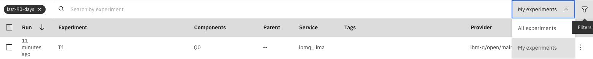
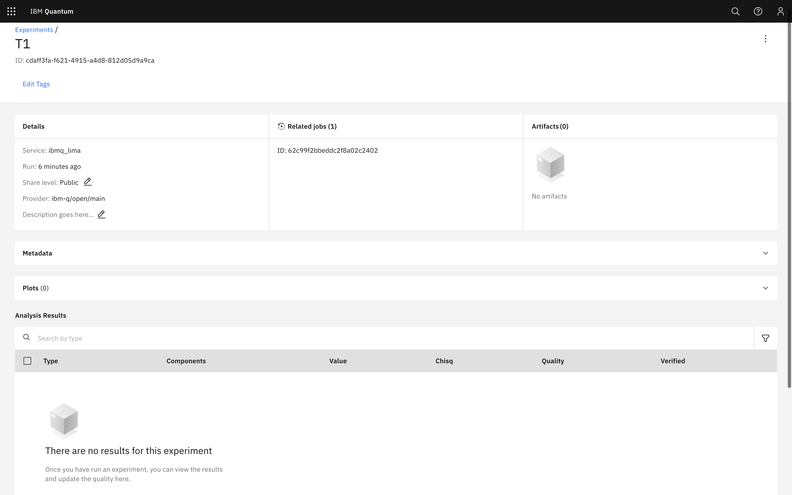

Save and load experiment data with the cloud service
====================================================

.. note::
    This recipe is only for those who have access to the cloud service. You can 
    check whether you do by logging into the IBM Quantum interface 
    and seeing if you can see the `database <https://quantum-computing.ibm.com/experiments>`__.

Problem
-------

You want to save and retrieve experiment data from the cloud service.

Solution
--------

Saving
~~~~~~

You will need to have :mod:`qiskit-ibmq-provider` installed locally 
and an account in the Qiskit cloud service. You must run the experiment on a real IBM
backend to be able to save it. You can save the experiment data by calling ``save()``:

.. jupyter-input::

    from qiskit import IBMQ
    IBMQ.load_account()
    provider = IBMQ.get_provider(hub="ibm-q", group="open", project="main")
    backend = provider.get_backend("ibmq_lima")

    from qiskit_experiments.library.characterization import T1
    import numpy as np
    
    t1_delays = np.arange(1e-6, 600e-6, 50e-6)

    exp = T1(qubit=0, delays=t1_delays)

    t1_expdata = exp.run(backend=backend, shots=1000).block_for_results()
    t1_expdata.save()

.. jupyter-output::

    You can view the experiment online at 
    https://quantum-computing.ibm.com/experiments/10a43cb0-7cb9-41db-ad74-18ea6cf63704

Loading
~~~~~~~

Let's load a `previous T1
experiment <https://quantum-computing.ibm.com/experiments/9640736e-d797-4321-b063-d503f8e98571>`__ 
(requires login to view), which we've made public by editing the ``Share level`` field:

.. jupyter-execute::
    :hide-output:
    :raises:

    from qiskit_experiments.framework.experiment_data import ExperimentData
    service = ExperimentData.get_service_from_backend(backend)
    load_expdata = ExperimentData.load("9640736e-d797-4321-b063-d503f8e98571", service)

To display the figure, which is serialized into a string, we need the
``SVG`` library:

.. jupyter-execute::
    :hide-output:
    :raises:

    from IPython.display import SVG
    SVG(load_expdata.figure(0).figure)

.. image:: ./experiment_cloud_service/t1_loaded.png

The analysis results have been retrieved as well:

.. jupyter-input::

    for result in load_expdata.analysis_results():
        print(result)

.. jupyter-output::

    AnalysisResult
    - name: T1
    - value: 0.0001040+/-0.0000028
    - χ²: 0.8523786276663019
    - quality: good
    - extra: <1 items>
    - device_components: ['Q0']
    - verified: False
    AnalysisResult
    - name: @Parameters_T1Analysis
    - value: CurveFitResult:
    - fitting method: least_squares
    - number of sub-models: 1
    * F_exp_decay(x) = amp * exp(-x/tau) + base
    - success: True
    - number of function evals: 9
    - degree of freedom: 9
    - chi-square: 7.671407648996717
    - reduced chi-square: 0.8523786276663019
    - Akaike info crit.: 0.6311217041870707
    - Bayesian info crit.: 2.085841653551072
    - init params:
    * amp = 0.923076923076923
    * tau = 0.00016946294665316433
    * base = 0.033466533466533464
    - fit params:
    * amp = 0.9266620487665083 ± 0.007096409569790425
    * tau = 0.00010401411623191737 ± 2.767679521974391e-06
    * base = 0.036302726197354626 ± 0.0037184540724124844
    - correlations:
    * (tau, base) = -0.6740808746060173
    * (amp, base) = -0.4231810882291163
    * (amp, tau) = 0.09302612202500576
    - quality: good
    - device_components: ['Q0']
    - verified: False

Discussion
----------

Calling :meth:`.ExperimentData.save` before the experiment is complete will
instantiate an experiment entry in the database, but it will not have
complete data. To fix this, you can call :meth:`~.ExperimentData.save` again once the
experiment is done running.

.. jupyter-input::

    from qiskit import IBMQ
    IBMQ.load_account()
    provider = IBMQ.get_provider(hub="ibm-q", group="open", project="main")
    backend = provider.get_backend("ibmq_lima")

    t1_expdata = exp.run(backend=backend, shots=1000).block_for_results()
    t1_expdata.save()

.. jupyter-output::

    You can view the experiment online at https://quantum-computing.ibm.com/experiments/10a43cb0-7cb9-41db-ad74-18ea6cf63704")

You can also view the results at the `IBM Quantum Experiments
pane <https://quantum-computing.ibm.com/experiments?date_interval=last-90-days&owner=me>`__
on the cloud.

By default, the interface displays all experiments you have privilege to
see, but this link shows your own experiments. You can change that
setting by clicking on the All Experiments dropdown. You can also filter
by device, date, provider, and result by clicking on the filter icon.

|

Individual experiment pages show the plot, and one or more important
analysis results, which for the :math:`T_1` experiment is the fitted
:math:`T_1` value.

.. image:: ./experiment_cloud_service/t1_experiment.png

|

The metadata field shows experiment metadata included in the :class:`.ExperimentData` object.

.. image:: ./experiment_cloud_service/metadata.png

|

You can change the quality and verify/unverify the results upon
selection of an analysis result. Quality is an automatic parameter
generated by the experiment analysis based on pre-set criteria. The verification field is for a
human to determine whether the result is acceptable.

.. image:: ./experiment_cloud_service/verify_experiment.png

Auto-saving an experiment
~~~~~~~~~~~~~~~~~~~~~~~~~

The :meth:`.ExperimentData.auto_save` feature automatically saves changes to the 
:class:`.ExperimentData` object to the cloud service whenever it's updated.

.. jupyter-input::

    exp = T1(qubit=0, delays=t1_delays)
    
    t1_expdata = exp.run(backend=backend, shots=1000)
    t1_expdata.auto_save = True
    t1_expdata.block_for_results()

.. jupyter-output::

    You can view the experiment online at https://quantum-computing.ibm.com/experiments/cdaff3fa-f621-4915-a4d8-812d05d9a9ca
    <ExperimentData[T1], backend: ibmq_lima, status: ExperimentStatus.DONE, experiment_id: cdaff3fa-f621-4915-a4d8-812d05d9a9ca>

Deleting an experiment
~~~~~~~~~~~~~~~~~~~~~~

Both figures and analysis results can be deleted. Note that unless you
have auto save on, the update has to be manually saved to the remote
database by calling :meth:`.ExperimentData.save`. Because there are two analysis
results, one for the T1 parameter and one for the curve fitting results, we must 
delete twice to fully remove the analysis results.

.. jupyter-input::
    
    t1_expdata.delete_figure(0)
    t1_expdata.delete_analysis_result(0)
    t1_expdata.delete_analysis_result(0)

.. jupyter-output::

    Are you sure you want to delete the experiment plot? [y/N]: y
    Are you sure you want to delete the analysis result? [y/N]: y
    Are you sure you want to delete the analysis result? [y/N]: y

The web interface shows that both the figure and analysis result have been
deleted:

Tagging and sharing experiments
~~~~~~~~~~~~~~~~~~~~~~~~~~~~~~~

Tags and notes can be added to experiments to help identify specific experiments in the interface.
For example, an experiment can be tagged and made public with the following code.

.. jupyter-input::
   
   t1_expdata.tags = ['tag1', 'tag2']
   t1_expdata.share_level = "public"
   t1_expdata.notes = "Example note."

These fields can also be updated in the web interface. For more information about 
using the interface, consult its 
`documentation <https://quantum-computing.ibm.com/lab/docs/iql/manage/experiments/>`__. 
	   
