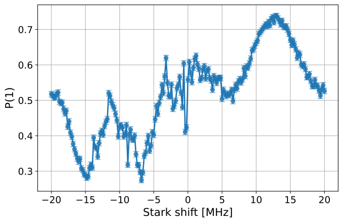

AC Stark Effect
===============

.. caution::

   The experiments described in this manual are deprecated as of Qiskit
   Experiments 0.8 and will be removed in a future release. They rely on Qiskit
   Pulse, which is `deprecated in Qiskit SDK
   <https://github.com/Qiskit/qiskit/issues/13063>`_, with planned removal in
   Qiskit 2.0.

When a qubit is driven with an off-resonant tone,
the qubit frequency :math:`f_0` is slightly shifted through what is known as the (AC) Stark effect.
This technique is sometimes used to characterize qubit properties in the vicinity of
the base frequency, especially with a fixed frequency qubit architecture which otherwise
doesn't have a knob to control frequency [1]_.

The important control parameters of the Stark effect are the amplitude
:math:`\Omega` and frequency :math:`f_S` of
the off-resonant tone, which we will call the *Stark tone* in the following.
In the low power limit, the amount of frequency shift :math:`\delta f_S`
that the qubit may experience is described as follows [2]_:

.. math::

    \delta f_S \approx \frac{\alpha}{2\Delta\left(\alpha - \Delta\right)} \Omega^2,

where :math:`\alpha` is the qubit anharmonicity and :math:`\Delta=f_S - f_0` is the
frequency separation of the Stark tone from the qubit frequency :math:`f_0`.
We sometimes call :math:`\delta f_S` the *Stark shift* [3]_.

.. _stark_tone_implementation:

Stark tone implementation in Qiskit
-----------------------------------

Usually, we fix the Stark tone frequency :math:`f_S` and control the amplitude :math:`\Omega`
to modulate the qubit frequency.
In Qiskit, we often use an abstracted amplitude :math:`\bar{\Omega}`,
instead of the physical amplitude :math:`\Omega` in the experiments.

Because the Stark shift :math:`\delta f_S` has a quadratic dependence on
the tone amplitude :math:`\Omega`, the resulting shift is not sensitive to its sign.
On the other hand, the sign of the shift depends on the sign of the frequency offset :math:`\Delta`.
In a typical parameter regime of :math:`|\Delta | < | \alpha |`,

.. math::

    \text{sign}(\delta f_S) = - \text{sign}(\Delta).

In other words, positive (negative) Stark shift occurs when the tone frequency :math:`f_S`
is lower (higher) than the qubit frequency :math:`f_0`.
When an experimentalist wants to perform spectroscopy of some qubit parameter
in the vicinity of :math:`f_0`, one must manage the sign of :math:`f_S`
in addition to the magnitude of :math:`\Omega`.

To alleviate such experimental complexity, an abstracted amplitude :math:`\bar{\Omega}`
with virtual sign is introduced in Qiskit Experiments.
This works as follows:

.. math::

    \Delta &= - \text{sign}(\bar{\Omega}) | \Delta |, \\
    \Omega &= | \bar{\Omega} |.

Stark experiments in Qiskit usually take two control parameters :math:`(\bar{\Omega}, |\Delta|)`,
which are specified by ``stark_amp`` and ``stark_freq_offset`` in the experiment options, respectively.
In this representation, the sign of the Stark shift matches the sign of :math:`\bar{\Omega}`.

.. math::

    \text{sign}(\delta f_S) = \text{sign}(\bar{\Omega})

This allows an experimentalist to control both the sign and the amount of
the Stark shift with the ``stark_amp`` experiment option.
Note that ``stark_freq_offset`` should be set as a positive number.

.. _stark_frequency_consideration:

Stark tone frequency
--------------------

As you can see in the equation for :math:`\delta f_S` above,
:math:`\Delta=0` yields a singular point where :math:`\delta f_S` diverges.
This corresponds to a Rabi drive, where the qubit is driven on resonance and
coherent state exchange occurs between :math:`|0\rangle` and :math:`|1\rangle`
instead of the Stark shift.
Another frequency that should be avoided for the Stark tone is :math:`\Delta=\alpha` which
corresponds to the transition from :math:`|1\rangle` to :math:`|2\rangle`.
In the high power limit, :math:`\Delta = \alpha/2` should also be avoided since
this causes the direct excitation from :math:`|0\rangle` to :math:`|2\rangle`
through what is known as a two-photon transition.

The Stark tone frequency must be sufficiently separated from all of these frequencies
to avoid unwanted state transitions (frequency collisions).
In reality, the choice of the frequency could be even more complicated
due to the transition levels of the nearest neighbor qubits.
The frequency must be carefully chosen to avoid frequency collisions [4]_.

.. _stark_channel_consideration:

Stark tone channel
------------------

It may be necessary to supply a pulse channel to apply the Stark tone.
In Qiskit Experiments, the Stark experiments usually have an experiment option ``stark_channel``
to specify this.
By default, the Stark tone is applied to the same channel as the qubit drive
with a frequency shift. This frequency shift might update the channel frame,
which accumulates unwanted phase against the frequency difference between
the qubit drive :math:`f_0` and Stark tone frequencies :math:`f_S` in addition to
the qubit Stark shift :math:`\delta f_s`.
You can use a dedicated Stark drive channel if available.
Otherwise, you may want to use a control channel associated with the physical
drive port of the qubit.

In a typical IBM device using the cross-resonance drive architecture,
such channel can be identified with your backend as follows:

.. note::
    This tutorial requires the :external+qiskit_ibm_runtime:doc:`qiskit-ibm-runtime <index>` package to model a
    backend.  You can install it with ``python -m pip install qiskit-ibm-runtime``.

.. jupyter-execute::

    from qiskit_ibm_runtime.fake_provider import FakeHanoiV2

    backend = FakeHanoiV2()
    qubit = 0

    for qpair in backend.coupling_map:
        if qpair[0] == qubit:
            break

    print(backend.control_channel(qpair)[0])

This returns a control channel for which the qubit is the control qubit.
This approach may not work for other device architectures.

Characterizing the frequency shift
----------------------------------

One can experimentally measure :math:`\delta f_S` with the :class:`.StarkRamseyXY` experiment.
The following pulse sequence illustrates how :math:`\delta f_S` is characterized
by a variant of the Hahn-echo pulse sequence [5]_.

.. jupyter-execute::
    :hide-code:

    %matplotlib inline

    import warnings

    warnings.filterwarnings(
        "ignore",
        message=".*Due to the deprecation of Qiskit Pulse.*",
        category=DeprecationWarning,
    )
    warnings.filterwarnings(
        "ignore",
        message=".*The entire Qiskit Pulse package is being deprecated.*",
        category=DeprecationWarning,
    )

    from qiskit_experiments.library import StarkRamseyXY
    from qiskit import schedule, pulse
    from qiskit_ibm_runtime.fake_provider import FakeHanoiV2
    from qiskit.visualization.pulse_v2 import IQXSimple

    backend = FakeHanoiV2()
    exp = StarkRamseyXY(
        physical_qubits=[0],
        backend=backend,
        stark_amp=0.2,
        delays=[100e-9],
        stark_channel=pulse.ControlChannel(0),
    )

    circ = exp.circuits()[0]
    ram_x_schedule = schedule(circ, backend=backend)

    opt = {
        "formatter.general.fig_chart_height": 10,
        "formatter.margin.top": 0.1,
        "formatter.margin.bottom": 0.2,
        "formatter.label_offset.pulse_name": 0.1,
        "formatter.text_size.annotate": 14,
    }
    ram_x_schedule.draw(time_range=(0, 1600), style=IQXSimple(**opt))

The qubit is initialized in the :math:`Y`-eigenstate with the first half-pi pulse.
This state may be visualized by a Bloch vector located on the equator of the Bloch sphere,
which is highly sensitive to Z rotation arising from any qubit frequency offset.
This operation is followed by a pi-pulse and another negative half-pi pulse
right before the measurement tone filled in red.
This sequence recovers the initial state when Z rotation is zero or :math:`\delta f_S=0`.

As you may notice, this sequence is interleaved with two pulses labeled
"StarkV" (Gaussian) and "StarkU" (GaussianSquare) filled in yellow, representing Stark tones.
These pulses are designed to have the same maximum amplitude :math:`\Omega` resulting
in the same :math:`\delta f_S` at this amplitude -- but why do we need two pulses?

Since :math:`\delta f_S` is amplitude dependent, the Stark pulses cause time-dependent
frequency shifts during the pulse ramps. With a single Stark tone, you are only able to estimate
the average :math:`\delta f_S` over the history of amplitudes :math:`\Omega(t)`,
even though you may want to characterize :math:`\delta f_S` at a particular :math:`\Omega`.
You have to remember that you cannot use a square envelope to set a uniform amplitude,
because the sharp rise and fall of the pulse amplitude has a broad frequency spectrum
which could produce unwanted excitations.

The pulse sequence shown above is adopted to address such issue.
The Z rotation accumulated by the first pulse is proportional to :math:`\int \Omega_V^2(t) dt`,
while that of the second pulse is :math:`-\int \Omega_U^2(t) dt` because
the qubit state is flipped by the pi-pulse in the middle,
flipping the sense of rotation of the state even though
the actual rotation direction is the same for both pulses.
The only difference between :math:`\Omega_U(t)` and :math:`\Omega_V(t)` is the flat-top part
with constant amplitude :math:`\Omega` and duration :math:`t_w`,
where :math:`\delta f_S` is also constant.
Thanks to this sign flip, the net Z rotation :math:`\theta` accumulated through the two pulses is
proportional to only the flat-top part of the StarkU pulse.

.. math::

    \theta = 2 \pi \int \delta f_S(t) dt
    \propto \int \Omega_U^2(t) dt - \int \Omega_V^2(t) dt
    = \Omega^2 t_w

This technique allows you to estimate :math:`\delta f_S` at a particular :math:`\Omega`.

In Qiskit Experiments, the experiment option ``stark_amp`` usually refers to
the height of this GaussianSquare flat-top.

Workflow
--------

In this example, you'll learn how to measure a spectrum of qubit relaxation versus
frequency with fixed frequency transmons.
As you already know, we give an offset to the qubit frequency with a Stark tone,
and the workflow starts from characterizing the amount of the Stark shift against
the Stark amplitude :math:`\bar{\Omega}` that you can experimentally control.

.. jupyter-input::

    from qiskit_experiments.library.driven_freq_tuning import StarkRamseyXYAmpScan

    exp = StarkRamseyXYAmpScan((0,), backend=backend)
    exp_data = exp.run().block_for_results()
    coefficients = exp_data.analysis_results("stark_coefficients").value

You first need to run the :class:`.StarkRamseyXYAmpScan` experiment that scans :math:`\bar{\Omega}`
and estimates the amount of the resultant frequency shift.
This experiment fits the frequency shift to a polynomial model which is a function of :math:`\bar{\Omega}`.
You can obtain the :class:`.StarkCoefficients` object that contains
all polynomial coefficients to map and reverse-map the :math:`\bar{\Omega}` to a corresponding frequency value.

This object may be necessary for the following spectroscopy experiment.
Since Stark coefficients are stable for a relatively long time,
you may want to save the coefficient values and load them later when you run the experiment.
If you have an access to the Experiment service, you can just save the experiment result.

.. jupyter-input::

    exp_data.save()

.. jupyter-output::

    You can view the experiment online at https://quantum.ibm.com/experiments/23095777-be28-4036-9c98-89d3a915b820

Otherwise, you can dump the coefficient object into a file with JSON format.

.. jupyter-input::

    import json
    from qiskit_experiments.framework import ExperimentEncoder

    with open("coefficients.json", "w") as fp:
        json.dump(ret_coeffs, fp, cls=ExperimentEncoder)

The saved object can be retrieved either from the service or file, as follows.

.. jupyter-input::

    # When you have access to Experiment service
    from qiskit_experiments.library.driven_freq_tuning import retrieve_coefficients_from_backend

    coefficients = retrieve_coefficients_from_backend(backend, 0)

    # Alternatively you can load from file
    from qiskit_experiments.framework import ExperimentDecoder

    with open("coefficients.json", "r") as fp:
        coefficients = json.load(fp, cls=ExperimentDecoder)

Now you can measure the qubit relaxation spectrum.
The :class:`.StarkP1Spectroscopy` experiment also scans :math:`\bar{\Omega}`,
but instead of measuring the frequency shift, it measures the excited state population P1
after certain delay, :code:`t1_delay` in the experiment options, following the state population.
You can scan the :math:`\bar{\Omega}` values either in the "frequency" or "amplitude" domain,
but the :code:`stark_coefficients` option must be set to perform the frequency sweep.

.. jupyter-input::

    from qiskit_experiments.library.driven_freq_tuning import StarkP1Spectroscopy

    exp = StarkP1Spectroscopy((0,), backend=backend)

    exp.set_experiment_options(
        t1_delay=20e-6,
        min_xval=-20e6,
        max_xval=20e6,
        xval_type="frequency",
        spacing="linear",
        stark_coefficients=coefficients,
    )

    exp_data = exp.run().block_for_results()

You may find notches in the P1 spectrum, which may indicate the existence of TLS's
in the vicinity of your qubit drive frequency.

.. jupyter-input::

    exp_data.figure(0)

Note that this experiment doesn't yield any analysis result because the landscape of a P1 spectrum
can not be predicted due to the random occurrences of the TLS and frequency collisions.
If you have your own protocol to extract meaningful quantities from the data,
you can write a custom analysis subclass and give it to the experiment instance before execution.
See :class:`.StarkP1SpectAnalysis` for more details.

This protocol can be parallelized among many qubits unless crosstalk matters.

References
----------

.. [1] Malcolm Carroll, Sami Rosenblatt, Petar Jurcevic, Isaac Lauer and Abhinav Kandala,
    Dynamics of superconducting qubit relaxation times, npj Quantum Inf 8, 132 (2022).
    https://arxiv.org/abs/2105.15201

.. [2] Easwar Magesan, Jay M. Gambetta, Effective Hamiltonian models of the cross-resonance gate,
    Phys. Rev. A 101, 052308 (2020).
    https://arxiv.org/abs/1804.04073

.. [3] Wikipedia. "Autler–Townes effect" Wikipedia Foundation.
    https://en.wikipedia.org/wiki/Autler%E2%80%93Townes_effect

.. [4] Jared B. Hertzberg, Eric J. Zhang, Sami Rosenblatt, et. al.,
    Laser-annealing Josephson junctions for yielding scaled-up superconducting quantum processors,
    npj Quantum Information 7, 129 (2021).
    https://arxiv.org/abs/2009.00781

.. [5] J. Stehlik, D. M. Zajac, D. L. Underwood, et.al.,
    Tunable Coupling Architecture for Fixed-Frequency Transmon Superconducting Qubits,
    Phys. Rev. Lett. 127, 080505 (2021).
    https://arxiv.org/abs/2101.07746
