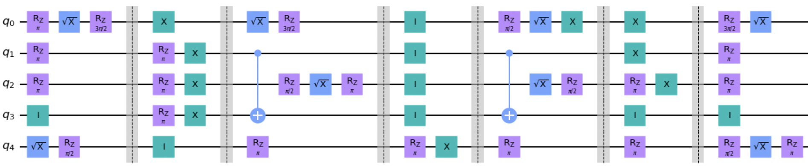

Mirror Randomized Benchmarking
==============================

Mirror randomized benchmarking (mirror RB) is a randomized benchmarking protocol
that is more scalable than standard randomized benchmarking and is suitable for
characterizing crosstalk errors over a large number of qubits in a quantum device. A
randomized Clifford mirror circuit [1]_ consists of:

- random n-qubit Clifford layers and their inverses sampled according to some
  distribution :math:`\Omega` over a layer set :math:`\mathbb{L}`,

- uniformly random one-qubit Paulis between these layers, and 
  
- a layer of uniformly random one-qubit Cliffords at the beginning and the end 
  of the circuit.

Note that the random n-qubit Clifford layers can be realized with only one-qubit
Cliffords and a two-qubit gate such as CX, which twirl the local errors sufficiently to
produce a useful metric of gate infidelity. This is in contrast to standard RB, which
requires the implementation of n-qubit Cliffords that have much more overhead for large
n. Mirror RB can also be generalized to universal gatesets beyond the Cliffords [2]_.

Output metrics
--------------

In standard and interleaved RB, :math:`n`-qubit circuits of varying lengths :math:`\ell`
that compose to the identity are run on a device, and the **success probability**
:math:`P`, the probability that the circuit's output bit string equals the input bit
string, is estimated for each circuit length by running several circuits at each length.
The :math:`P`-versus-:math:`\ell` curve is fit to the function :math:`A\alpha^\ell + b`,
and the error per Clifford (EPC) (the average infidelity) is estimated using 

.. math::

    r = \frac{\left(2^n - 1\right)p}{2^n}.

Our implementation of MRB computes additional values in addition to the 
success probability that have been seen in the literature and ``pyGSTi``. 
Specifically, we compute the **adjusted success probability** 

.. math::

    P_0 = \sum_{k=0}^n \left(-\frac{1}{2}\right)^k h_k, 

where :math:`h_k` is the probability of the actual output bit string being Hamming
distance :math:`k` away from the expected output bit string (note :math:`h_0 = P`). We
also compute the **effective polarization**, which is fitted and visualized by default:

.. math::

    S = \frac{4^n P_0}{4^n - 1} - \frac{1}{4^n - 1}.

In [1]_, the function :math:`A\alpha^\ell` (without a baseline) is fit to the 
effective polarizations to find entanglement infidelities.

In Qiskit Experiments, mirror RB analysis results include the following:

- ``alpha``: the depolarizing parameter. The user can select which of :math:`P, P_0, S` 
  to fit, and the corresponding :math:`\alpha` will be provided.

- ``EPC``: the expectation of the average gate infidelity of a layer sampled 
  according to :math:`\Omega`.

- ``EI``: the expectation of the entanglement infidelity of a layer sampled 
  according to :math:`\Omega`. 

Note that the ``EPC`` :math:`\epsilon_a` and the ``EI`` :math:`\epsilon_e` are 
related by 

.. math:: 

    \epsilon_e = \left(1 + \frac{1}{2^n}\right) \epsilon_a, 

where :math:`n` is the number of qubits (see [2]_). 

Running a mirror RB experiment
------------------------------

The distribution for sampling layers, :math:`\Omega`, must be specified by the user when
instantiating a mirror RB experiment. A commonly used :math:`\Omega` is one generated by
the **edge grab** algorithm [3]_. The Clifford layers in :math:`\mathbb{L}` are
constructed from a gate set consisting of one-qubit Clifford gates and a single
two-qubit Clifford gate (e.g., CX) that can be applied to any two connected qubits. The
user can specify an expected two-qubit gate density :math:`\xi \in \left[0,
\frac{1}{2}\right]`, and each intermediate Clifford layer will have approximately
:math:`n \xi` CXs on average.

Even though a :class:`.MirrorRB` experiment can be instantiated without a backend, the
backend must be specified when the circuits are sampled because :math:`\Omega` depends
on the backend's connectivity. To use your own :math:`\Omega`, you have to implement
your own subclass of the abstract :class:`.BaseSampler` class, but here we will use
the built-in :class:`.EdgeGrabSampler`. Here's how to instantiate and run the
experiment:

.. jupyter-execute::

    import numpy as np
    from qiskit_experiments.library import MirrorRB
    from qiskit_experiments.library.randomized_benchmarking.sampling_utils import EdgeGrabSampler

    from qiskit_aer import AerSimulator
    from qiskit.providers.fake_provider import FakeParis
    
    backend = AerSimulator.from_backend(FakeParis())

    lengths = np.arange(2, 810, 200)
    num_samples = 5
    seed = 1010
    qubits = (0,1)

    exp_2q = MirrorRB(qubits, lengths, backend=backend, num_samples=num_samples, seed=seed)
    expdata_2q = exp_2q.run(backend).block_for_results()
    results_2q = expdata_2q.analysis_results()

.. jupyter-execute::

    print("Gate error ratio: %s" % expdata_2q.experiment.analysis.options.gate_error_ratio)
    display(expdata_2q.figure(0))
    for result in results_2q:
        print(result)

Selecting :math:`y`-axis values
~~~~~~~~~~~~~~~~~~~~~~~~~~~~~~~

You can set what you want to use as the :math:`y`-axis metric for fitting by setting
the ``y-axis`` analysis option. Here's an example of plotting the success probability 
instead of the default:

.. jupyter-execute::

    lengths = np.arange(2,202,50)
    num_samples = 5
    seed = 42
    qubits = (0,)

    exp = MirrorRB(qubits, lengths, backend=backend, num_samples=num_samples, seed=seed)
    
    # select y-axis, can also be "Adjusted Success Probability" or "Effective Polarization"
    exp.analysis.set_options(y_axis="Success Probability")
    
    # y-axis label must be set separately
    exp.analysis.options.plotter.set_figure_options(
        ylabel="Success Probability",
    )
    expdata = exp.run(backend).block_for_results()
    results = expdata.analysis_results()

.. jupyter-execute::

    display(expdata.figure(0))
    for result in results:
        print(result)

Mirror RB user options
~~~~~~~~~~~~~~~~~~~~~~

There are several options that change the composition of the mirror RB circuit layers.

There are three boolean options that 

- ``pauli_randomize`` (default ``True``): if ``True``, put layers of uniformly 
  random Paulis between the intermediate Clifford layers

- ``start_end_clifford`` (default ``True``): if ``True``, begin the circuit with 
  uniformly random one-qubit Cliffords and end the circuit with their inverses

- ``inverting_pauli_layer`` (default ``False``): if ``True``, add a layer of 
  Paulis at the end of the circuit to set the output to 
  :math:`\left\vert0\right\rangle^{\otimes n}`, up to a global phase

The default settings produce the circuits in Ref [1]_.

Let's look at how these options change the circuit. First, the default with Pauli layers
between Cliffords and single-qubit Cliffords at the start and end:

.. jupyter-execute::

    exp = MirrorRB((0,1,2),
                   lengths=[2],
                   seed=100,
                   backend=backend,
                   num_samples=1)
    exp.circuits()[0].decompose().draw("mpl")

And now with both options turned off:

.. jupyter-execute::

    exp = MirrorRB((0,1,2),
                   lengths=[2],
                   seed=100,
                   backend=backend,
                   num_samples=1,
                   start_end_clifford=False,
                   two_qubit_gate_density=0.4,
                   pauli_randomize=False,
                   inverting_pauli_layer=True)
    exp.circuits()[0].decompose().draw("mpl")

Another important option is ``two_qubit_gate_density`` (default ``0.2``). This is the
expected fraction of two-qubit gates in the circuit, not accounting for the optional
constant number of Clifford and Pauli layers at the start and end. This means that given
the same ``two_qubit_gate_density``, if ``pauli_randomize`` is off, the concentration of
CX gates in the Clifford layers will be halved so that the overall density doesn't
change. We'll demonstrate this by first leaving ``pauli_randomize`` on:

.. jupyter-execute::

    # choose a linear string on this backend for ease of visualization
    exp = MirrorRB((0,1,2,3,5,8,11,14),
                   lengths=[2],
                   two_qubit_gate_density=0.5,
                   seed=120,
                   backend=backend,
                   num_samples=1,
                   start_end_clifford=False)
    exp.circuits()[0].remove_final_measurements(inplace=False).draw("mpl")

And now we remove the Pauli layers to see that the CX density in the Clifford layers
has decreased:

.. jupyter-execute::

    exp = MirrorRB((0,1,2,3,5,8,11,14),
                   lengths=[2],
                   two_qubit_gate_density=0.5,
                   pauli_randomize=False,
                   seed=120,
                   backend=backend,
                   num_samples=1,
                   start_end_clifford=False)
    exp.circuits()[0].remove_final_measurements(inplace=False).draw("mpl")

Note that the edge grab algorithm is probabilistic, and only tends to the exact two
qubit gate density asymptotically.

Custom layer distributions
~~~~~~~~~~~~~~~~~~~~~~~~~~

It is possible to customize the layer distributions when running mirror RB by setting 
the distribution and its options directly using the :attr:`.MirrorRB.distribution`
attribute. Note that if the distribution options are set manually after experiment 
instantiation, the experiment will let you override experiment options such as
``two_qubit_gate_density`` with your custom distribution.

Here is an example where we override the default distribution and change the gate
distribution manually into one with 20% single-qubit Paulis and 80% two-qubit
:class:`~.qiskit.circuit.library.ECRGate` (Consult the :class:`.EdgeGrabSampler`
documentation for details on available options):

.. jupyter-execute::

    from qiskit.circuit.library import ECRGate
    from qiskit.circuit.library import HGate

    exp = MirrorRB(range(4),
                   lengths=[2],
                   two_qubit_gate_density=0.5,
                   seed=101,
                   backend=backend,
                   num_samples=1,
                   start_end_clifford=False)
    exp.distribution.gate_distribution = [(0.4, 1, "pauli"),(0.4, 1, HGate()),(0.2, 2, ECRGate())]
    exp.circuits()[0].remove_final_measurements(inplace=False).draw("mpl")

If we reset the distribution to :class:`.EdgeGrabSampler`, we will get the expected
default behavior again.

.. jupyter-execute::

    exp.distribution = EdgeGrabSampler
    exp.circuits()[0].remove_final_measurements(inplace=False).draw("mpl")

It is possible to set the distribution to another sampler entirely, or your own custom sampler:

.. jupyter-execute::

    from qiskit_experiments.library.randomized_benchmarking.sampling_utils import SingleQubitSampler
    from qiskit.circuit.library import SGate, HGate

    exp.distribution = SingleQubitSampler
    exp.distribution.gate_distribution = [(0.5, 1, SGate()), (0.5, 1, HGate())]
    exp.circuits()[0].remove_final_measurements(inplace=False).draw("mpl")

Note that only Clifford gates can be used.

Mirror RB implementation in ``pyGSTi``
~~~~~~~~~~~~~~~~~~~~~~~~~~~~~~~~~~~~~~

The :mod:`pygsti` implementation of mirror RB,
:class:`~.pygsti.protocols.rb.MirrorRBDesign`, can be used for testing and comparison.
We note however that ``pyGSTi`` transpiles circuits slightly differently, producing
small discrepancies in fit parameters between the two codes. To illustrate, consider the
two circuits below, both of which were generated in ``pyGSTi``. This first circuit was
transpiled in ``pyGSTi``:

This second circuit was transpiled in Qiskit:

.. image:: images/pygsti-data-qiskit-transpiled-circ.png

Note the different implementations of the same Clifford on 
qubit 0 in the fifth layer.

References
----------

.. [1] Timothy Proctor, Stefan Seritan, Kenneth Rudinger, Erik Nielsen, Robin 
       Blume-Kohout, Kevin Young, *Scalable randomized benchmarking of quantum 
       computers using mirror circuits*, https://arxiv.org/pdf/2112.09853.pdf

.. [2] Hines, Jordan, et al. *Demonstrating scalable randomized benchmarking of
       universal gate sets*, https://arxiv.org/abs/2207.07272

.. [3] Timothy Proctor, Kenneth Rudinger, Kevin Young, Erik Nielsen, and Robin 
       Blume-Kohout, *Measuring the Capabilities of Quantum Computers*, 
       https://arxiv.org/pdf/2008.11294.pdf

See also
--------

* API documentation: :mod:`.MirrorRB`
* Experiment manual: :doc:`/manuals/verification/randomized_benchmarking`
