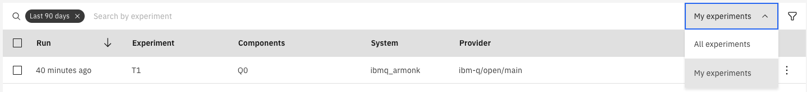
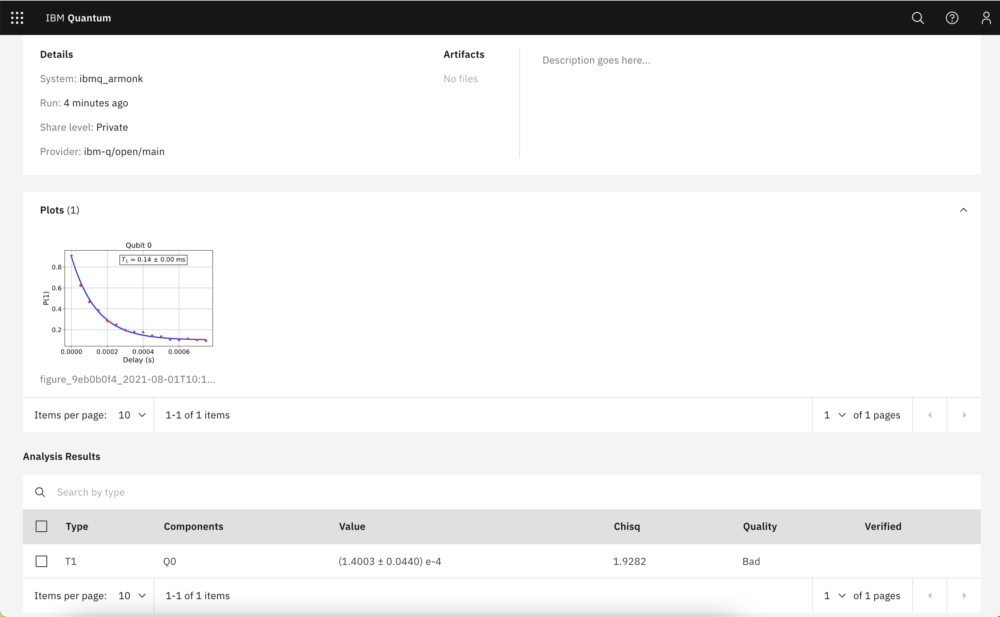
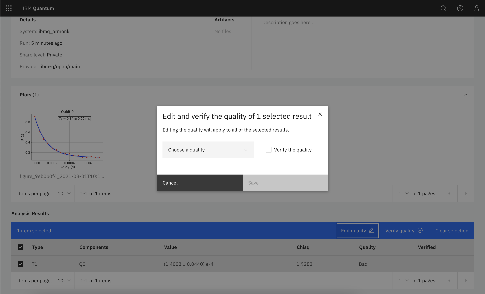
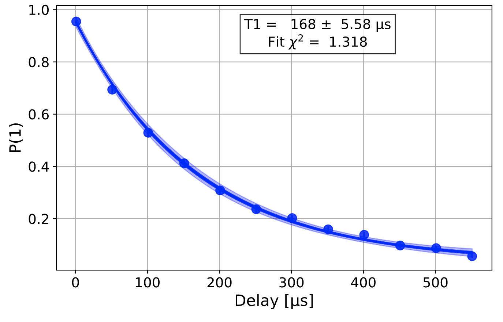
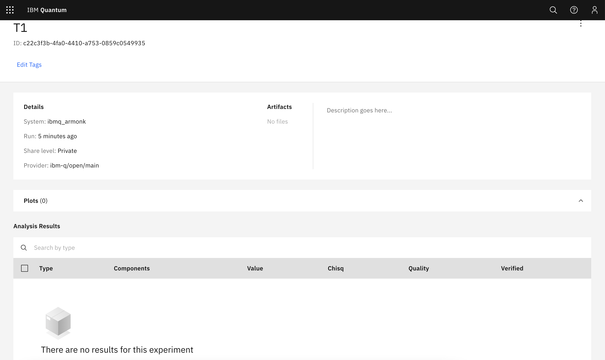
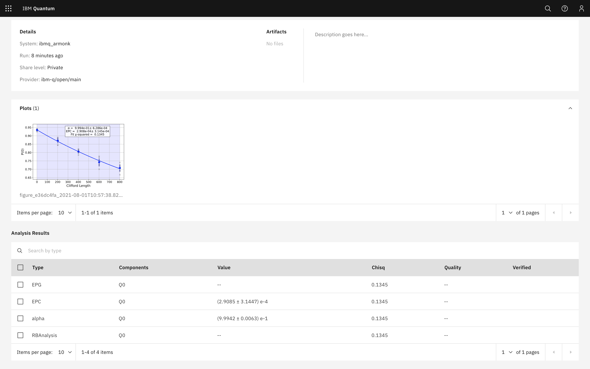
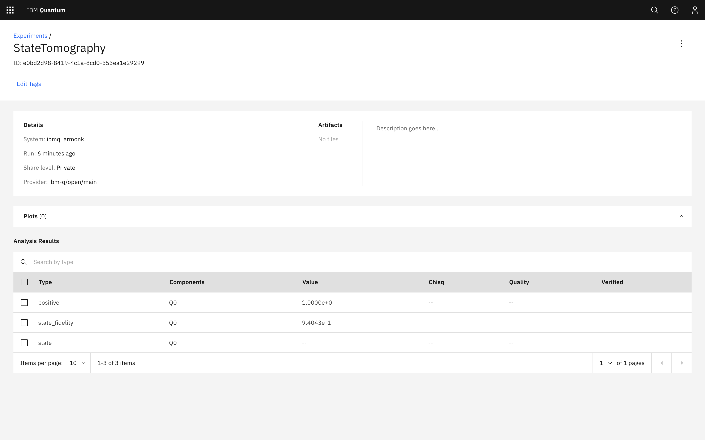

Saving Experiment Data to the Cloud
===================================

Qiskit Experiments is designed to work with Qiskit’s `online experiment
database <https://quantum-computing.ibm.com/experiments>`__, where you
can view and share results of experiments you’ve run. This tutorial
shows how to save your experimental results to the database. You will
need to have ``qiskit-ibmq-provider`` installed locally and an account
in the Qiskit cloud service. We will use the ``ibmq_armonk`` backend
which is open and available to everyone.

:math:`T_1` Experiment
----------------------

Let’s run a :math:`T_1` experiment and save the results to the
experiment database.

.. jupyter-execute::

    from qiskit_experiments.library.characterization import T1
    import numpy as np
    
    t1_delays = np.arange(1e-6, 600e-6, 50e-6)
    
    # Create an experiment for qubit 0,
    # setting the unit to microseconds,
    # with the specified time intervals
    exp = T1(qubit=0, delays=t1_delays)
    print(exp.circuits()[0])

Now we run the experiment. ``block_for_results()`` blocks execution
until the experiment is complete, then ``save()`` is called to save the
data to ResultsDB.

.. jupyter-execute::
    :hide-code:
    :hide-output:

    from qiskit.test.ibmq_mock import mock_get_backend
    backend = mock_get_backend('FakeArmonk')

.. jupyter-execute::

    from qiskit import IBMQ
    IBMQ.load_account()
    provider = IBMQ.get_provider(hub="ibm-q", group="open", project="main")
    backend = provider.get_backend("ibmq_armonk")

    t1_expdata = exp.run(backend=backend, shots=1000).block_for_results()
    t1_expdata.save()

.. jupyter-execute::
    :hide-code:

    print("You can view the experiment online at https://quantum-computing.ibm.com/experiments/96b86d51-5200-4270-8ac1-ce4c20188ab9")

Note that calling ``save()`` before the experiment is complete will
instantiate an experiment entry in the database, but it will not have
complete data. To fix this, you can call ``save()`` again once the
experiment is done running.

Our :math:`T_1` figure and analysis results:

.. jupyter-execute::

    display(t1_expdata.figure(0))
    for result in t1_expdata.analysis_results():
        print(result)

You can also view the results at the `IBM Quantum Experiments
pane <https://quantum-computing.ibm.com/experiments?date_interval=last-90-days&owner=me>`__
on the cloud.

By default, the interface displays all experiments you have privilege to
see, but this link shows your own experiments. You can change that
setting by clicking on the All Experiments dropdown. You can also filter
by device, date, provider, and result by clicking on the filter icon.

Individual experiment pages show the plot, and one or more important
analysis results, which for the :math:`T_1` experiment is the fitted
:math:`T_1` value.

You can change the quality and verify/unverify the results upon
selection of an analysis result. Quality is an automatic parameter
generated by the experiment analysis based on pre-set criteria; in this
case the :math:`T_1` fit is considered bad because the amplitude
parameter is not close enough to 1. The verification field is for a
human to determine whether the result is acceptable.

Loading an experiment from the database
~~~~~~~~~~~~~~~~~~~~~~~~~~~~~~~~~~~~~~~

You can also load the full saved experiment from the database service.
Let’s load a `previous T1
experiment <https://quantum-computing.ibm.com/experiments/96b86d51-5200-4270-8ac1-ce4c20188ab9>`__,
which we’ve made public by editing the ``Share level`` field:

.. jupyter-execute::

    from qiskit_experiments.framework.experiment_data import ExperimentData
    service = ExperimentData.get_service_from_backend(backend)
    load_exp = ExperimentData.load("96b86d51-5200-4270-8ac1-ce4c20188ab9", service)

To display the figure, which is serialized into a string, we need the
SVG library:

.. jupyter-execute::
    :hide-output:
    :raises:

    from IPython.display import SVG
    SVG(load_exp.figure(0))

We’ve also retrieved the full analysis results from the database:

.. jupyter-execute::

    for result in load_exp.analysis_results():
        print(result)

.. jupyter-execute::
    :hide-code:

    print ("""AnalysisResult
    - name: T1
    - value: 0.000168+/-0.000006
    - χ²: 1.3178510503089684
    - quality: ResultQuality.GOOD
    - extra: <1 items>
    - device_components: ['Q0']
    - verified: False
    AnalysisResult
    - name: @Parameters_T1Analysis
    - value: [0.9211991764658336, 0.035243060640676796, 0.00016807035946402193]
    - χ²: 1.3178510503089684
    - quality: ResultQuality.GOOD
    - extra: <4 items>
    - device_components: ['Q0']
    - verified: False""")

Auto-saving an experiment
~~~~~~~~~~~~~~~~~~~~~~~~~

The ``auto_save`` feature saves the data of an
experiment preemptively before it runs. In the future, you will be able to set
``provider.experiment.set_option(auto_save=True)`` to turn ``auto_save``
on by default at the experiment service level.

.. jupyter-execute::

    exp = T1(qubit=0, delays=t1_delays)
    
    t1_expdata = exp.run(backend=backend, shots=1000)
    t1_expdata.auto_save = True
    t1_expdata.block_for_results()

Deleting an experiment
~~~~~~~~~~~~~~~~~~~~~~

Both figures and analysis results can be deleted. Note that unless you
have auto save on, the update has to be manually saved to the remote
database by calling ``save()``.

.. jupyter-execute::

    t1_expdata.delete_figure(0)
    t1_expdata.delete_analysis_result(0)

The interface shows that both the figure and analysis result have been
deleted: |t1_deleted.png|

Tagging and sharing experiments
~~~~~~~~~~~~~~~~~~~~~~~~~~~~~~~

Tags and notes can be added to experiments to help identify specific experiments in the interface.
For example, an experiment can be tagged and made public with the following code.

.. jupyter-execute::
   
   t1_expdata.tags = ['tag1', 'tag2']
   t1_expdata.share_level = "public"
   t1_expdata.notes = "Example note."
   t1_expdata.save()

These fields can also be updated in the web interface from the menu on the right of each experiment.

|web_tags_share.png|

.. |web_tags_share.png| image:: ./experiment_cloud_service/web_tags_share.png

For more information about using the cloud database interface, please take a look at its `documentation <https://quantum-computing.ibm.com/lab/docs/iql/manage/experiments/>`__. 

Randomized Benchmarking experiment
----------------------------------

Let’s now do a standard RB experiment and save the results to ResultsDB.

.. jupyter-execute::

    from qiskit_experiments.library import randomized_benchmarking as rb
    
    lengths = list(range(1, 1000, 200))
    num_samples = 10
    seed = 1010
    
    rb_exp = rb.StandardRB([0], lengths, num_samples=num_samples, seed=seed)
    rb_expdata = rb_exp.run(backend).block_for_results()
    rb_expdata.save()

.. jupyter-execute::

    display(rb_expdata.figure(0))
    for result in rb_expdata.analysis_results():
        print(result)

Here is the view of the same job on the database service. Note that
``EPG`` and ``RBAnalysis`` are lists of values, and so are not shown on
the user interface unlike the single value fields:

State tomography experiment
---------------------------

Let’s do state tomography on a Hadamard state.

.. jupyter-execute::

    from qiskit_experiments.library import StateTomography
    import qiskit
    
    # Construct state by applying H gate
    qc_h = qiskit.QuantumCircuit(1)
    qc_h.h(0)
    
    qstexp = StateTomography(qc_h)
    qst_expdata = qstexp.run(backend).block_for_results()
    qst_expdata.save()
    
    for result in qst_expdata.analysis_results():
        print(result)

The tomography experiment doesn’t have associated figures. Similar to
randomized benchmarking, the tomography matrix is not directly shown in the
graphical interface, but the other analysis parameters are:

|
	   
.. jupyter-execute::

    import qiskit.tools.jupyter
    %qiskit_copyright

