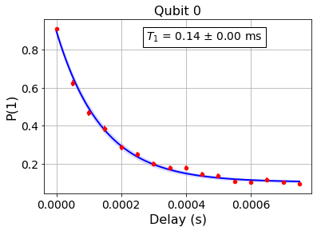
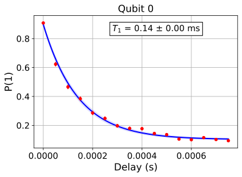
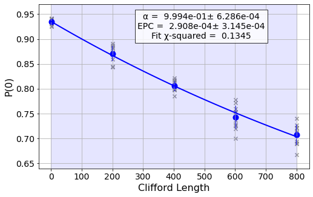

Saving Experiment Data to the Cloud
===================================

Qiskit Experiments is designed to work with Qiskit’s `online experiment
database <https://quantum-computing.ibm.com/experiments>`__, where you
can view and share results of experiments you’ve run. This tutorial
shows how to save your experimental results to the database. You will
need to have ``qiskit-ibmq-provider`` installed locally and an account
in the Qiskit cloud service. We will use the ``ibmq_armonk`` backend
which is open and available to everyone.

.. code:: ipython3

    from qiskit import IBMQ
    
    IBMQ.load_account()
    provider = IBMQ.get_provider(hub="ibm-q", group="open", project="main")
    backend = provider.get_backend("ibmq_armonk")

:math:`T_1` Experiment
----------------------

Let’s run a :math:`T_1` experiment and save the results to the
experiment database.

.. code:: ipython3

    from qiskit_experiments.library.characterization import T1
    
    t1_delays = list(range(0, 800, 50))
    
    # Create an experiment for qubit 0,
    # setting the unit to microseconds,
    # with the specified time intervals
    exp = T1(qubit=0, delays=t1_delays, unit="us")
    print(exp.circuits()[0])

.. parsed-literal::

         ┌───┐ ░ ┌──────────────┐ ░ ┌─┐
    q_0: ┤ X ├─░─┤ Delay(0[us]) ├─░─┤M├
         └───┘ ░ └──────────────┘ ░ └╥┘
    c: 1/════════════════════════════╩═
                                     0 

Now we run the experiment. ``block_for_results()`` blocks execution
until the experiment is complete, then ``save()`` is called to save the
data to ResultsDB.

.. code:: ipython3

    # Run the experiment circuits with 1000 shots each,
    # and analyze the result
    
    t1_expdata = exp.run(backend=backend, shots=1000).block_for_results()
    t1_expdata.save()

Note that calling ``save()`` before the experiment is complete will
instantiate an experiment entry in the database, but it will not have
complete data. To fix this, you can call ``save()`` again once the
experiment is done running.

Our :math:`T_1` figure and analysis results:

.. code:: ipython3

    display(t1_expdata.figure(0))
    for result in t1_expdata.analysis_results():
        print(result)

.. parsed-literal::

    DbAnalysisResultV1
    - name: T1
    - value: 0.00014003438826912983 ± 4.398101339932208e-06 s
    - χ²: 1.9282291758563228
    - quality: bad
    - extra: <8 items>
    - device_components: ['Q0']
    - verified: False

You can also view the results at the `IBM Quantum Experiments
pane <https://quantum-computing.ibm.com/experiments?date_interval=last-90-days&owner=me>`__
on the cloud.

By default, the interface displays all experiments you have privilege to
see, but this link shows your own experiments. You can change that
setting by clicking on the All Experiments dropdown. You can also filter
by device, date, provider, and result by clicking on the filter icon.

.. image:: ./experiment_cloud_service/image.png

Individual experiment pages show the plot, and one or more important
analysis results, which for the :math:`T_1` experiment is the fitted
:math:`T_1` value.

.. image:: ./experiment_cloud_service/t1_experiment.png

You can change the quality and verify/unverify the results upon
selection of an analysis result. Quality is an automatic parameter
generated by the experiment analysis based on pre-set criteria; in this
case the :math:`T_1` fit is considered bad because the amplitude
parameter is not close enough to 1. The verification field is for a
human to determine whether the result is acceptable.

.. image:: ./experiment_cloud_service/verify_experiment.png

Loading an experiment from the database
~~~~~~~~~~~~~~~~~~~~~~~~~~~~~~~~~~~~~~~

You can also load the full saved experiment from the database service.
Let’s load a `previous T1
experiment <https://quantum-computing.ibm.com/experiments/9eb0b0f4-be97-4c57-9665-8c9ff09442e8>`__,
which we’ve made public by editing the ``Share level`` field:

.. code:: ipython3

    from qiskit_experiments.database_service import DbExperimentDataV1 as DbExperimentData
    
    load_exp = DbExperimentData.load("9eb0b0f4-be97-4c57-9665-8c9ff09442e8", provider.service("experiment"))

To display the figure, which is serialized into a string, we need the
SVG library:

.. code:: ipython3

    from IPython.display import SVG
    SVG(load_exp.figure(0))

We’ve also retrieved the full analysis results from the database:

.. code:: ipython3

    for result in load_exp.analysis_results():
        print(result)

.. parsed-literal::

    DbAnalysisResultV1
    - name: T1
    - value: 0.00014003438826912983 ± 4.398101339932208e-06 s
    - χ²: 1.9282291758563228
    - quality: ResultQuality.BAD
    - extra: <8 items>
    - device_components: ['Q0']
    - verified: False

Auto-saving an experiment
~~~~~~~~~~~~~~~~~~~~~~~~~

There is also the ``auto_save`` feature, which saves the data of an
experiment preemptively. In the future, you will be able to set
``provider.experiment.set_option(auto_save=True)`` to turn ``auto_save``
on by default at the experiment service level.

.. code:: ipython3

    exp = T1(qubit=0, delays=t1_delays, unit="us")
    
    t1_expdata = exp.run(backend=backend, shots=1000)
    t1_expdata.auto_save = True
    t1_expdata.block_for_results()

.. parsed-literal::

    Not all post-processing has finished. Consider calling save() again after all post-processing is done to save any newly generated data.
    Analysis result cannot be saved because no experiment service is available.

.. parsed-literal::

    ExperimentData(T1, c22c3f3b-4fa0-4410-a753-0859c0549935, backend=ibmq_armonk, job_ids=['6106b1e569320609fc186865'])

Deleting an experiment
~~~~~~~~~~~~~~~~~~~~~~

Both figures and analysis results can be deleted. Note that unless you
have auto save on, the update has to be manually saved to the remote
database by calling ``save()``.

.. code:: ipython3

    t1_expdata.delete_figure(0)
    t1_expdata.delete_analysis_result(0)

.. parsed-literal::

    
    Are you sure you want to delete the experiment plot? [y/N]: y
    
    Are you sure you want to delete the analysis result? [y/N]: y

.. parsed-literal::

    '6ae505d7-a2ba-4f21-b962-42cfe6b5fdd1'

The interface shows that both the figure and analysis result have been
deleted: |t1_deleted.png|

.. |t1_deleted.png| image:: ./experiment_cloud_service/t1_deleted.png

RB experiment
-------------

Let’s now do a standard RB experiment and save the results to ResultsDB.

.. code:: ipython3

    from qiskit_experiments.library import randomized_benchmarking as rb
    
    lengths = list(range(1, 1000, 200))
    num_samples = 10
    seed = 1010
    
    rb_exp = rb.StandardRB([0], lengths, num_samples=num_samples, seed=seed)
    rb_expdata = rb_exp.run(backend).block_for_results()
    rb_expdata.save()

.. code:: ipython3

    display(rb_expdata.figure(0))
    for result in rb_expdata.analysis_results():
        print(result)

.. parsed-literal::

    DbAnalysisResultV1
    - name: RBAnalysis
    - value: [0.62327871 0.99941831 0.31212028] ± [0.56502796 0.00062857 0.56631132]
    - χ²: 0.13454473118612684
    - extra: <10 items>
    - device_components: ['Q0']
    - verified: False
    DbAnalysisResultV1
    - name: alpha
    - value: 0.9994183055710573 ± 0.000628570304337799
    - χ²: 0.13454473118612684
    - device_components: ['Q0']
    - verified: False
    DbAnalysisResultV1
    - name: EPC
    - value: 0.0002908472144713681 ± 0.0003144680764970782
    - χ²: 0.13454473118612684
    - device_components: ['Q0']
    - verified: False
    DbAnalysisResultV1
    - name: EPG
    - value: {0: {'rz': 0.0, 'sx': 0.00015093763767253147, 'x': 0.00015093763767253147}}
    - χ²: 0.13454473118612684
    - device_components: ['Q0']
    - verified: False

Here is the view of the same job on the database service. Note that
``EPG`` and ``RBAnalysis`` are lists of values, and so are not shown on
the user interface unlike the single value fields:

.. image:: ./experiment_cloud_service/rb_experiment-2.png

State tomography experiment
---------------------------

Let’s do state tomography on a Hadamard state.

.. code:: ipython3

    from qiskit_experiments.library import StateTomography
    import qiskit
    
    # Construct state by applying H gate
    qc_h = qiskit.QuantumCircuit(1)
    qc_h.h(0)
    
    qstexp = StateTomography(qc_h)
    qst_expdata = qstexp.run(backend).block_for_results()
    qst_expdata.save()
    
    for result in qst_expdata.analysis_results():
        print(result)

.. parsed-literal::

    DbAnalysisResultV1
    - name: state
    - value: DensityMatrix([[0.5078125 +0.j        , 0.44042969-0.00878906j],
                   [0.44042969+0.00878906j, 0.4921875 +0.j        ]],
                  dims=(2,))
    - extra: <4 items>
    - device_components: ['Q0']
    - verified: False
    DbAnalysisResultV1
    - name: state_fidelity
    - value: 0.9404296875000002
    - device_components: ['Q0']
    - verified: False
    DbAnalysisResultV1
    - name: positive
    - value: True
    - device_components: ['Q0']
    - verified: False

The tomography experiment doesn’t have associated figures. Similar to
randomized benchmarking, the tomography matrix is not shown in the
graphical interface, but the other analysis parameters are:

.. image:: ./experiment_cloud_service/tomo_experiment.png

|
	   
.. code:: ipython3

    import qiskit.tools.jupyter
    %qiskit_copyright

.. raw:: html

    
<h3>This code is a part of Qiskit</h3>
&copy; Copyright IBM 2017, 2021.

This code is licensed under the Apache License, Version 2.0. You may obtain a copy of this license in the LICENSE.txt file in the root directory  of this source tree or at http://www.apache.org/licenses/LICENSE-2.0.
Any modifications or derivative works of this code must retain this copyright notice, and modified files need to carry a notice indicating that they have been altered from the originals.

