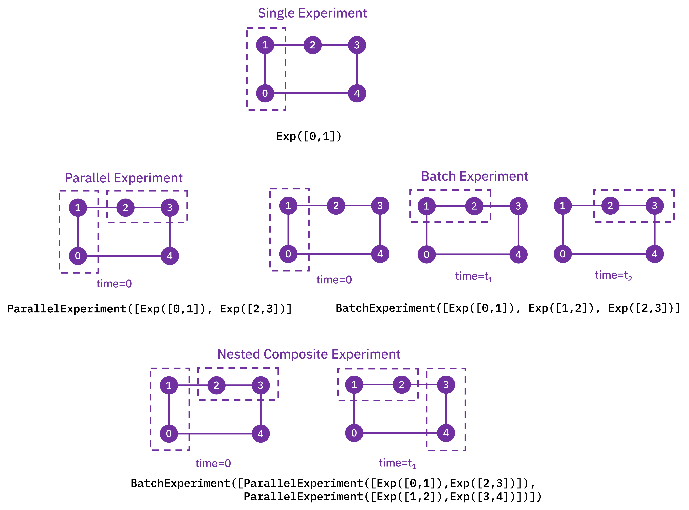

===============
Getting Started
===============

Installation
============

Qiskit Experiments is built on top of Qiskit, so we recommend that you first install
Qiskit following its `installation guide <https://docs.quantum.ibm.com/start/install>`__. Qiskit
Experiments supports the same platforms as Qiskit itself and Python versions 3.8 through 3.12.

Qiskit Experiments releases can be installed via the Python package manager ``pip``
in your shell environment:

.. code-block::

    python -m pip install qiskit-experiments

There are a number of optional packages that enable some experiments and features. If you 
would like to install these optional dependencies, run:

.. code-block::

    python -m pip install "qiskit-experiments[extras]"

If you want to run the most up-to-date version instead (may not be stable), you can
install the latest main branch:

.. code-block::

    python -m pip install git+https://github.com/Qiskit-Community/qiskit-experiments.git

If you want to develop the package, you can install Qiskit Experiments from source by
cloning the repository:

.. code-block::

    git clone https://github.com/Qiskit-Community/qiskit-experiments.git
    python -m pip install -e "qiskit-experiments[extras]"

The ``-e`` option will keep your installed package up to date as you make or pull new
changes.

Upgrading Qiskit Experiments
----------------------------

Qiskit Experiments version numbers are in the form ``0.X.Y``, where ``X`` is the minor version and
``Y`` is the patch version. There are two kinds of releases: minor releases, which increment the
minor version, and patch releases, which increment the patch version. New features and API
changes can only be introduced in a minor release. Patch releases contain only bug fixes and changes that do
not affect how you use the package, such as performance optimization and documentation updates.

Therefore, when you encounter a bug or unexpected behavior, it is recommended that you first check if there's a
patch release you can upgrade to under the same minor version to avoid any breaking changes. When
running ``pip``, you can specify the exact version to install:

.. code-block::

    python -m pip install qiskit-experiments==0.X.Y

Before a nontrivial breaking API change is introduced in a minor release, the old feature will
undergo a deprecation process lasting two releases for a core framework change and one release
otherwise. During this process, deprecation warnings will be issued if you use the old feature that
will instruct you on how to transition to the replacement feature, if applicable. The :doc:`release
notes </release_notes>` contain full details on which features are deprecated or removed in each
release.

Running your first experiment
=============================

Let's run a :class:`.T1` Experiment, which estimates the characteristic relaxation time
of a qubit from the excited state to the ground state, also known as :math:`T_1`, by
measuring the excited state population after varying delays. First, we have to import
the experiment from the Qiskit Experiments library:

.. jupyter-execute::

    from qiskit_experiments.library import T1

Experiments must be run on a backend. We're going to use a simulator,
:class:`~qiskit_ibm_runtime.fake_provider.FakePerth`, for this example, but you can use any
backend, real or simulated, that you can access through Qiskit.

.. note::
    This tutorial requires the :external+qiskit_aer:doc:`qiskit-aer <index>` and :external+qiskit_ibm_runtime:doc:`qiskit-ibm-runtime <index>`
    packages to run simulations.  You can install them with ``python -m pip
    install qiskit-aer qiskit-ibm-runtime``.

.. jupyter-execute::

    from qiskit_ibm_runtime.fake_provider import FakePerth
    from qiskit_aer import AerSimulator

    backend = AerSimulator.from_backend(FakePerth())

All experiments require a ``physical_qubits`` parameter as input that specifies which
physical qubit or qubits the circuits will be executed on. The qubits must be given as a
Python sequence (usually a tuple or a list).

In addition, the :math:`T_1` experiment has
a second required parameter, ``delays``, which is a list of times in seconds at which to
measure the excited state population. In this example, we'll run the :math:`T_1`
experiment on qubit 0, and use the ``t1`` backend property of this qubit to give us a
good estimate for the sweep range of the delays.

.. jupyter-execute::

    import numpy as np
    
    qubit0_t1 = FakePerth().qubit_properties(0).t1
    delays = np.arange(1e-6, 3 * qubit0_t1, 3e-5)

    exp = T1(physical_qubits=(0,), delays=delays)

The circuits encapsulated by the experiment can be accessed using the experiment's
:meth:`~.BaseExperiment.circuits` method, which returns a list of circuits that can be
run on a backend. Let's print the range of delay times we're sweeping over and draw the
first and last circuits for our :math:`T_1` experiment:

.. jupyter-execute::

    print(delays)
    exp.circuits()[0].draw(output="mpl", style="iqp")

.. jupyter-execute::

    exp.circuits()[-1].draw(output="mpl", style="iqp")

As expected, the delay block spans the full range of time values that we specified.

The :class:`.ExperimentData` class
==================================

After instantiating the experiment, we run the experiment by calling
:meth:`~.BaseExperiment.run` with our backend of choice. This transpiles our experiment
circuits then packages them into jobs that are run on the backend.

.. note::
    See the how-tos for :doc:`customizing job splitting </howtos/job_splitting>` when
    running an experiment. 

This statement returns the :class:`.ExperimentData` class containing the results of the
experiment, so it's crucial that we assign the output to a data variable. We could have
also provided the backend at the instantiation of the experiment, but specifying the
backend at run time allows us to run the same exact experiment on different backends
should we choose to do so.

.. jupyter-execute::

    exp_data = exp.run(backend=backend).block_for_results()

The :meth:`~.ExperimentData.block_for_results` method is optional and is used to block
execution of subsequent code until the experiment has fully completed execution and
analysis. If

.. jupyter-input::
    
    exp_data = exp.run(backend=backend)

is executed instead, the statement will finish running as soon as the jobs are
submitted, but the analysis callback won't populate ``exp_data`` with results until the
entire process has finished. In this case, there are two useful methods in the
:class:`.ExperimentData`, :meth:`~.ExperimentData.job_status` and
:meth:`~.ExperimentData.analysis_status`, that return the current status of the job and
analysis, respectively:

.. jupyter-execute::

    print(exp_data.job_status())
    print(exp_data.analysis_status())

Figures
-------

Once the analysis is complete, figures are retrieved using the
:meth:`~.ExperimentData.figure` method. See the :doc:`visualization module
<visualization>` tutorial on how to customize figures for an experiment. For our
:math:`T_1` experiment, we have a single figure showing the raw data and fit to the
exponential decay model of the :math:`T_1` experiment:

.. jupyter-execute::

    display(exp_data.figure(0))

Analysis Results
----------------

The analysis results resulting from the fit are accessed with
:meth:`~.ExperimentData.analysis_results`. If the ``dataframe=True`` parameter is passed, analysis
results will be retrieved in the pandas :class:`~pandas:pandas.DataFrame` format:

.. jupyter-execute::

    exp_data.analysis_results(dataframe=True)

Alternatively, analysis results can be accessed via the legacy list format:

.. jupyter-execute::

    for result in exp_data.analysis_results():
        print(result)

Individual results can be retrieved using their name or their long or short IDs, which will all
return the corresponding :class:`AnalysisResult` object:

.. jupyter-execute::
    :hide-code:

    result_id = exp_data.analysis_results("T1").result_id
    short_id = result_id.split("-")[0]
    print(f"exp_data.analysis_results(\"T1\")")
    print(f"exp_data.analysis_results(\"{result_id}\")")
    print(f"exp_data.analysis_results(\"{short_id}\")")

.. attention::
    Retrieving analysis results by a numerical index, whether an integer or a slice, is deprecated
    as of 0.6 and will be removed in a future release.

Each analysis
result value is a ``UFloat`` object from the ``uncertainties`` package. The nominal
value and standard deviation of each value can be accessed as follows:

.. jupyter-execute::

    print(exp_data.analysis_results("T1").value.nominal_value)
    print(exp_data.analysis_results("T1").value.std_dev)

For further documentation on how to work with UFloats, consult the ``uncertainties``
:external+uncertainties:doc:`user_guide`.

Artifacts
---------

The curve fit data itself is contained in :meth:`~.ExperimentData.artifacts`, which are accessed
in an analogous manner. Artifacts for a standard experiment include both the curve fit data
stored in ``artifacts("curve_data")`` and information on the fit stored in ``artifacts("fit_summary")``.
Use the ``data`` attribute to access artifact data:

.. jupyter-execute::

    print(exp_data.artifacts("fit_summary").data)

.. note::
    See the :doc:`artifacts </howtos/artifacts>` how-to for more information on using artifacts.

Circuit data and metadata
-------------------------

Raw circuit output data and its associated metadata can be accessed with the
:meth:`~.ExperimentData.data` property. Data is indexed by the circuit it corresponds
to. Depending on the measurement level set in the experiment, the raw data will either
be in the key ``counts`` (level 2) or ``memory`` (level 1 IQ data).

.. note::
    See the :doc:`data processor tutorial <data_processor>` for more 
    information on level 1 and level 2 data.

Circuit metadata contains information set by the experiment on a circuit-by-circuit
basis; ``xval`` is used by the analysis to extract the x value for each circuit when
fitting the data.

.. jupyter-execute::

    print(exp_data.data(0))

Experiments also have global associated metadata accessed by the
:meth:`~.ExperimentData.metadata` property.

.. jupyter-execute::

    print(exp_data.metadata)

Job information
---------------

The actual backend jobs that were executed for the experiment can be accessed with the
:meth:`~.ExperimentData.jobs` method.

.. note::
    See the how-tos for :doc:`rerunning the analysis </howtos/rerun_analysis>`
    for an existing experiment that finished execution.

.. _guide_setting_options:

Setting options for your experiment
===================================

It's often insufficient to run an experiment with only its default options. There are
four types of options one can set for an experiment:

Run options
-----------

These options are passed to the experiment's :meth:`~.BaseExperiment.run` method and
then to the ``run()`` method of your specified backend. Any run option that your backend
supports can be set:

.. jupyter-execute::

  from qiskit.qobj.utils import MeasLevel

  exp.set_run_options(shots=1000,
                      meas_level=MeasLevel.CLASSIFIED)
  print(f"Shots set to {exp.run_options.get('shots')}, " 
        "measurement level set to {exp.run_options.get('meas_level')}")

Consult the documentation of the run method of your
specific backend type for valid options.
For example, see :meth:`qiskit_ibm_runtime.IBMBackend.run` for IBM backends.

Transpile options
-----------------
These options are passed to the Qiskit :mod:`~qiskit.transpiler` to transpile the experiment circuits
before execution:

.. jupyter-execute::

  exp.set_transpile_options(scheduling_method='asap',
                            optimization_level=3,
                            basis_gates=["x", "sx", "rz"])
  print(f"Transpile options are {exp.transpile_options}")

Consult the documentation of :func:`qiskit.compiler.transpile` for valid options.

Experiment options
------------------
These options are unique to each experiment class. Many experiment options can be set
upon experiment instantiation, but can also be explicitly set via
:meth:`~.BaseExperiment.set_experiment_options`:

.. jupyter-execute::

    exp = T1(physical_qubits=(0,), delays=delays)
    new_delays=np.arange(1e-6, 600e-6, 50e-6)
    exp.set_experiment_options(delays=new_delays)
    print(f"Experiment options are {exp.experiment_options}")

Consult the :doc:`API documentation </apidocs/index>` for the options of each experiment
class.

Analysis options
----------------

These options are unique to each analysis class. Unlike the other options, analysis
options are not directly set via the experiment object but use instead a method of the
associated ``analysis``:

.. jupyter-execute::

    from qiskit_experiments.library import StandardRB

    exp = StandardRB(physical_qubits=(0,),
                    lengths=list(range(1, 300, 30)),
                    seed=123,
                    backend=backend)
    exp.analysis.set_options(gate_error_ratio=None)

Consult the :doc:`API documentation </apidocs/index>` for the options of each
experiment's analysis class.

Running experiments on multiple qubits
======================================

To run experiments across many qubits of the same device, we use **composite
experiments**. A :class:`.CompositeExperiment` is a parent object that contains one or more child
experiments, which may themselves be composite. There are two core types of composite
experiments:

* **Parallel experiments** run across qubits simultaneously as set by the user. The
  circuits of child experiments are combined into new circuits that map circuit gates
  onto qubits in parallel. Therefore, the circuits in child experiments *cannot* overlap
  in the ``physical_qubits`` parameter. The marginalization of measurement data for
  analysis of each child experiment is handled automatically. 
* **Batch experiments** run consecutively in time. These child circuits *can* overlap in
  qubits used.

Using parallel experiments, we can measure the :math:`T_1` of one qubit while doing a
standard Randomized Benchmarking :class:`.StandardRB` experiment on other qubits
simultaneously on the same device:

.. jupyter-execute::

    from qiskit_experiments.framework import ParallelExperiment

    child_exp1 = T1(physical_qubits=(2,), delays=delays)
    child_exp2 = StandardRB(physical_qubits=(3,1), lengths=np.arange(1,100,10), num_samples=2)
    parallel_exp = ParallelExperiment([child_exp1, child_exp2])

Note that when the transpile and run options are set for a composite experiment, the
child experiments's options are also set to the same options recursively. Let's examine
how the parallel experiment is constructed by visualizing child and parent circuits. The
child experiments can be accessed via the
:meth:`~.CompositeExperiment.component_experiment` method, which indexes from zero:

.. jupyter-execute::

    parallel_exp.component_experiment(0).circuits()[0].draw(output="mpl", style="iqp")

.. jupyter-execute::

    parallel_exp.component_experiment(1).circuits()[0].draw(output="mpl", style="iqp")

Similarly, the child analyses can be accessed via :meth:`.CompositeAnalysis.component_analysis` or via
the analysis of the child experiment class:

.. jupyter-execute::

    parallel_exp.component_experiment(0).analysis.set_options(plot = True)

    # This should print out what we set because it's the same option
    print(parallel_exp.analysis.component_analysis(0).options.get("plot"))

The circuits of all experiments assume they're acting on virtual qubits starting from
index 0. In the case of a parallel experiment, the child experiment
circuits are composed together and then reassigned virtual qubit indices:

.. jupyter-execute::

    parallel_exp.circuits()[0].draw(output="mpl", style="iqp")

During experiment transpilation, a mapping is performed to place these circuits on the
physical layout. We can see its effects by looking at the transpiled
circuit, which is accessed via the internal method ``_transpiled_circuits()``. After
transpilation, the :class:`.T1` experiment is correctly placed on physical qubit 2
and the :class:`.StandardRB` experiment's gates are on physical qubits 3 and 1.

.. jupyter-execute::

    parallel_exp._transpiled_circuits()[0].draw(output="mpl", style="iqp")

:class:`.ParallelExperiment` and :class:`.BatchExperiment` classes can also be nested
arbitrarily to make complex composite experiments.

Viewing child experiment data
-----------------------------

The experiment data returned from a composite experiment contains analysis
results for each child experiment in the parent experiment.

.. note::

    By default, all analysis results will be stored in the parent data object,
    and you need to explicitly set ``flatten_results=False`` to generate child
    data objects in the legacy format.

.. jupyter-execute::

    parallel_exp = ParallelExperiment(
        [T1(physical_qubits=(i,), delays=delays) for i in range(2)]
    )
    parallel_data = parallel_exp.run(backend, seed_simulator=101).block_for_results()

    parallel_data.analysis_results(dataframe=True)

Broadcasting analysis options to child experiments
--------------------------------------------------

Use the `broadcast` parameter to set analysis options to each of the child experiments.

.. jupyter-execute::

    parallel_exp.analysis.set_options(plot=False, broadcast=True)

If the child experiment inherits from :class:`.CompositeExperiment` (such as :class:`.ParallelExperiment`
and :class:`.BatchExperiment` classes), this process will continue to work recursively.
In this instance, the analysis will not generate a figure for the child experiment after the analysis.
