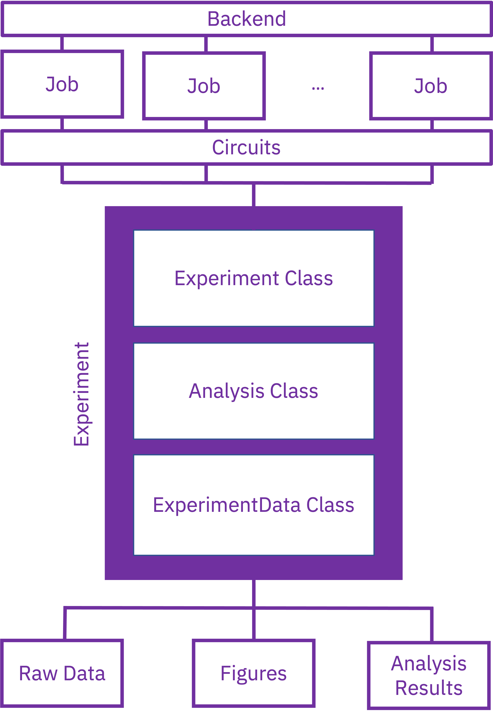

============
Introduction
============

What is Qiskit Experiments?
===========================

Qiskit Experiments is a package for running device characterization and calibration 
experiments on top of the core functionality of Qiskit.

An **experiment** comprises a series of circuits and associated metadata. 
Once the experiment circuits are executed on a quantum backend, either 
real or simulated, analysis is run automatically on the jobs and results
in the form of data, fit parameters, and figures are generated.

In addition to the experiment framework itself, Qiskit Experiments also has a rich 
library of experiments for calibrating and characterizing qubits.

What Qiskit Experiments can do
==============================

* Run characterization and calibration experiments such as quantum
  volume and randomized benchmarking
* Run built-in or customized experiments with all the options available in Qiskit
* Specify fit series and parameters in the analysis
* Transform the data through the data processor
* Visualize data with support for custom drawing backends
* Save and retrieve timestamped calibration parameters for physical backends

.. _primer:

A quick primer
==============

The Qiskit Experiments package consists of the experimental framework and the experiment
library. The framework itself consists of ``Experiment`` and ``Analysis`` classes, the
latter of which uses the Data Processor, Curve Analysis, and Visualization modules
to process the data, fit it to specified models, and plot the results, respectively.

Experiments start with an ``Experiment`` class, which instantiates the circuits that
will be run and also the metadata and options that will be used for the experiment, 
transpilation, execution, and analysis. During execution, circuits are automatically
packaged into one or more jobs for the specified backend device.

Each ``Experiment`` class is tied to its corresponding ``Analysis`` class. Once jobs
complete execution, the ``Analysis`` class processes and analyzes raw data to output 
an ``ExperimentData`` class that contains
the resulting analysis results, figures, metadata, as well as the original raw data.

