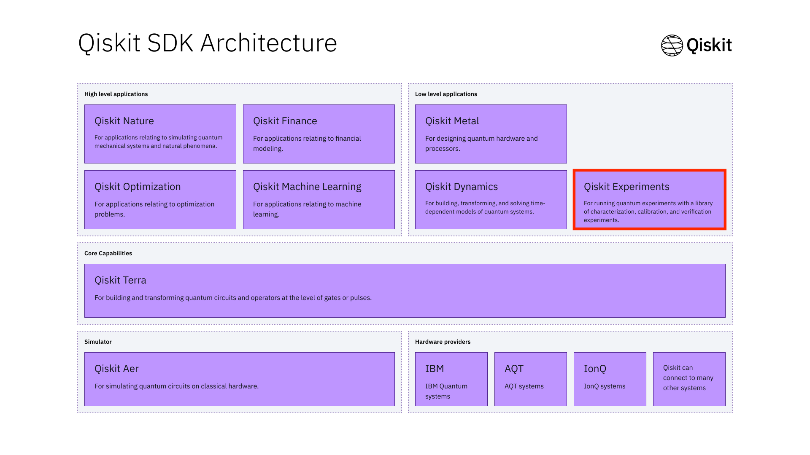

Introduction
============

Qiskit Experiments is a tool for those interested in running quantum experiments on top
of Qiskit.

Qiskit Experiment is centered around the concept of **experiments**. An experiment
is a series of circuits and analysis and is built on top of the core functionality
of Qiskit Terra. Once an experiment is executed on a quantum backend through a series 
of jobs, analysis is run automatically and useful data and figures are generated.

In addition to the experiment framework itself, Qiskit Experiments also has a rich 
library of experiments for calibrating and characterizing qubits.

What Qiskit Experiments Can Do
------------------------------

* Run a series of circuits with all the options that Terra has
* Specify fit series and parameters
* Transform the data through the data processor

A Quick Getting Started Tour
---------------------------------

* The experiment class
* Relationship to jobs
* The experiment data class