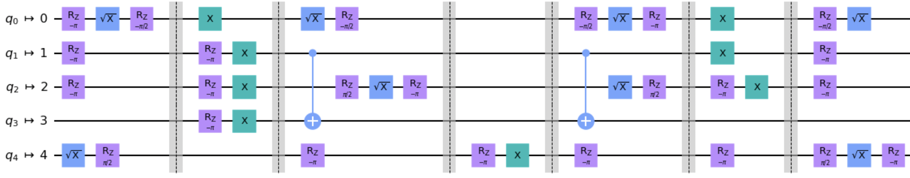

Randomized Benchmarking
=======================

A randomized benchmarking (RB) experiment consists of the generation of
random Clifford circuits on the given qubits such that the unitary
computed by the circuits is the identity. After running the circuits,
the number of shots resulting in an error (i.e. an output different than
the ground state) are counted, and from this data one can infer error
estimates for the quantum device, by calculating the Error Per Clifford.
See `Qiskit
Textbook <https://qiskit.org/textbook/ch-quantum-hardware/randomized-benchmarking.html>`__
for an explanation on the RB method, which is based on Ref. [1, 2].

.. jupyter-execute::
    :hide-code:

    %matplotlib inline

.. jupyter-execute::

    import numpy as np
    from qiskit_experiments.library import StandardRB, InterleavedRB, MirrorRB
    from qiskit_experiments.framework import ParallelExperiment, BatchExperiment
    import qiskit.circuit.library as circuits
    
    # For simulation
    from qiskit.providers.aer import AerSimulator
    from qiskit.providers.fake_provider import FakeParis
    
    backend = AerSimulator.from_backend(FakeParis())

Standard RB experiment
----------------------

To run the RB experiment we need to provide the following RB parameters,
in order to generate the RB circuits and run them on a backend:

-  ``qubits``: The number of qubits or list of physical qubits for the
   experiment

-  ``lengths``: A list of RB sequences lengths

-  ``num_samples``: Number of samples to generate for each sequence
   length

-  ``seed``: Seed or generator object for random number generation. If
   ``None`` then ``default_rng`` will be used

-  ``full_sampling``: If ``True`` all Cliffords are independently
   sampled for all lengths. If ``False`` for sample of lengths longer
   sequences are constructed by appending additional Clifford samples to
   shorter sequences. The default is ``False``

The analysis results of the RB Experiment may include:

-  ``EPC``: The estimated Error Per Clifford

-  ``alpha``: The depolarizing parameter. The fitting function is
   :math:`a \cdot \alpha^m + b`, where :math:`m` is the Clifford length

-  ``EPG``: The Error Per Gate calculated from the EPC, only for 1-qubit
   or 2-qubit quantum gates (see Ref. [3])

Running a 1-qubit RB experiment
~~~~~~~~~~~~~~~~~~~~~~~~~~~~~~~

Standard RB experiment will provide you gate errors for every basis gates
constituting averaged Clifford gate. Note that you can only obtain a single EPC value :math:`\cal E`
from a single RB experiment. As such, computing the error values for multiple gates :math:`\{g_i\}`
requires some assumption of contribution of each gate to the total depolarizing error.
This is so called ``gate_error_ratio`` option you can find in analysis options.

Provided that we have :math:`n_i` gates with independent error :math:`e_i` per Clifford,
the total EPC is estimated by the composition of error from every basis gate,

.. math::

    {\cal E} = 1 - \prod_{i} (1 - e_i)^{n_i} \sim \sum_{i} n_i e_i + O(e^2),

where :math:`e_i \ll 1` and the higher order terms can be ignored.

We cannot distinguish :math:`e_i` with a single EPC value :math:`\cal E` as explained,
however by defining an error ratio :math:`r_i` with respect to
some standard value :math:`e_0`, we can compute EPG :math:`e_i` for each basis gate.

.. math::

    {\cal E} \sim e_0 \sum_{i} n_i r_i

The EPG of :math:`i` th basis gate will be

.. math::

    e_i \sim r_i e_0 = \dfrac{r_i{\cal E}}{\sum_{i} n_i r_i}.

Because EPGs are computed based on this simple assumption,
this is not necessary representing the true gate error on the hardware.
If you have multiple kinds of basis gates with unclear error ratio :math:`r_i`,
interleaved RB experiment will always give you accurate error value :math:`e_i`.

.. jupyter-execute::

    lengths = np.arange(1, 800, 200)
    num_samples = 10
    seed = 1010
    qubits = [0]
    
    # Run an RB experiment on qubit 0
    exp1 = StandardRB(qubits, lengths, num_samples=num_samples, seed=seed)
    expdata1 = exp1.run(backend).block_for_results()
    results1 = expdata1.analysis_results()
    
    # View result data
    print("Gate error ratio: %s" % expdata1.experiment.analysis.options.gate_error_ratio)
    display(expdata1.figure(0))
    for result in results1:
        print(result)

Running a 2-qubit RB experiment
~~~~~~~~~~~~~~~~~~~~~~~~~~~~~~~

In the same way we can compute EPC for two-qubit RB experiment.
However, the EPC value obtained by the experiment indicates a depolarization
which is a composition of underlying error channels for 2Q gates and 1Q gates in each qubit.
Usually 1Q gate contribution is small enough to ignore, but in case this
contribution is significant comparing to the 2Q gate error,
we can decompose the contribution of 1Q gates [3].

.. math::

    \alpha_{2Q,C} = \frac{1}{5} \left( \alpha_0^{N_1/2} + \alpha_1^{N_1/2} +
     3 \alpha_0^{N_1/2} \alpha_1^{N_1/2} \right) \alpha_{01}^{N_2},

where :math:`\alpha_i` is the single qubit depolarizing parameter of channel :math:`i`,
and :math:`\alpha_{01}` is the two qubit depolarizing parameter of interest.
:math:`N_1` and :math:`N_2` are total count of single and two qubit gates, respectively.

Note that the single qubit gate sequence in the channel :math:`i` may consist of
multiple kinds of basis gates :math:`\{g_{ij}\}` with different EPG :math:`e_{ij}`.
Therefore the :math:`\alpha_i^{N_1/2}` should be computed from EPGs,
rather than directly using the :math:`\alpha_i`, which is usually a composition of
depolarizing maps of every single qubit gate.
As such, EPGs should be measured in the separate single-qubit RBs in advance.

.. math::

    \alpha_i^{N_1/2} = \alpha_{i0}^{n_{i0}} \cdot \alpha_{i1}^{n_{i1}} \cdot ...,

where :math:`\alpha_{ij}^{n_{ij}}` indicates a depolarization due to
a particular basis gate :math:`j` in the channel :math:`i`.
Here we assume EPG :math:`e_{ij}` corresponds to the depolarizing probability
of the map of :math:`g_{ij}`, and thus we can express :math:`\alpha_{ij}` with EPG.

.. math::

    e_{ij} = \frac{2^n - 1}{2^n} (1 - \alpha_{ij}) =  \frac{1 - \alpha_{ij}}{2},

for the single qubit channel :math:`n=1`. Accordingly,

.. math::

    \alpha_i^{N_1/2} = \prod_{j} (1 - 2 e_{ij})^{n_{ij}},

as a composition of depolarization from every primitive gates per qubit.
This correction will give you two EPC values as a result of the two-qubit RB experiment.
The corrected EPC must be closer to the outcome of of interleaved RB.
The EPGs of two-qubit RB are analyzed with the corrected EPC if available.

.. jupyter-execute::

    lengths_2_qubit = np.arange(1, 200, 30)
    lengths_1_qubit = np.arange(1, 800, 200)
    num_samples = 10
    seed = 1010
    qubits = (1, 4)

    # Run a 1-qubit RB expriment on qubits 1, 4 to determine the error-per-gate of 1-qubit gates
    single_exps = BatchExperiment(
        [
            StandardRB([qubit], lengths_1_qubit, num_samples=num_samples, seed=seed)
            for qubit in qubits
        ],
        flatten_results=True,
    )
    expdata_1q = single_exps.run(backend).block_for_results()

.. jupyter-execute::

    # Run an RB experiment on qubits 1, 4
    exp_2q = StandardRB(qubits, lengths_2_qubit, num_samples=num_samples, seed=seed)
    
    # Use the EPG data of the 1-qubit runs to ensure correct 2-qubit EPG computation
    exp_2q.analysis.set_options(epg_1_qubit=expdata_1q.analysis_results())
    
    # Run the 2-qubit experiment
    expdata_2q = exp_2q.run(backend).block_for_results()

    # View result data
    print("Gate error ratio: %s" % expdata_2q.experiment.analysis.options.gate_error_ratio)
    display(expdata_2q.figure(0))
    for result in expdata_2q.analysis_results():
        print(result)

Note that ``EPC_corrected`` value is smaller than one of raw ``EPC``, which indicates
contribution of depolarization from single-qubit error channels.

Displaying the RB circuits
~~~~~~~~~~~~~~~~~~~~~~~~~~

Generating an example RB circuit:

.. jupyter-execute::

    # Run an RB experiment on qubit 0
    exp = StandardRB(qubits=[0], lengths=[10], num_samples=1, seed=seed)
    c = exp.circuits()[0]

We transpile the circuit into the backend’s basis gate set:

.. jupyter-execute::

    from qiskit import transpile
    basis_gates = backend.configuration().basis_gates
    print(transpile(c, basis_gates=basis_gates))

Interleaved RB experiment
-------------------------

Interleaved RB experiment is used to estimate the gate error of the
interleaved gate (see Ref. [4]).

In addition to the usual RB parameters, we also need to provide:

-  ``interleaved_element``: the element to interleave, given either as a
   group element or as an instruction/circuit

The analysis results of the RB Experiment includes the following:

-  ``EPC``: The estimated error of the interleaved gate

-  ``alpha`` and ``alpha_c``: The depolarizing parameters of the
   original and interleaved RB sequences respectively

Extra analysis results include

-  ``EPC_systematic_err``: The systematic error of the interleaved gate
   error (see Ref. [4])

-  ``EPC_systematic_bounds``: The systematic error bounds of the
   interleaved gate error (see Ref. [4])

Running a 1-qubit interleaved RB experiment
~~~~~~~~~~~~~~~~~~~~~~~~~~~~~~~~~~~~~~~~~~~

.. jupyter-execute::

    lengths = np.arange(1, 800, 200)
    num_samples = 10
    seed = 1010
    qubits = [0]
    
    # Run an Interleaved RB experiment on qubit 0
    # The interleaved gate is the x gate
    int_exp1 = InterleavedRB(
        circuits.XGate(), qubits, lengths, num_samples=num_samples, seed=seed)
    
    # Run
    int_expdata1 = int_exp1.run(backend).block_for_results()
    int_results1 = int_expdata1.analysis_results()

.. jupyter-execute::

    # View result data
    display(int_expdata1.figure(0))
    for result in int_results1:
        print(result)

Running a 2-qubit interleaved RB experiment
~~~~~~~~~~~~~~~~~~~~~~~~~~~~~~~~~~~~~~~~~~~

.. jupyter-execute::

    lengths = np.arange(1, 200, 30)
    num_samples = 10
    seed = 1010
    qubits = [1,4]
    
    # Run an Interleaved RB experiment on qubits 1, 4
    # The interleaved gate is the cx gate
    int_exp2 = InterleavedRB(
        circuits.CXGate(), qubits, lengths, num_samples=num_samples, seed=seed)
    
    # Run
    int_expdata2 = int_exp2.run(backend).block_for_results()
    int_results2 = int_expdata2.analysis_results()

.. jupyter-execute::

    # View result data
    display(int_expdata2.figure(0))
    for result in int_results2:
        print(result)

Mirror RB experiment
--------------------

Mirror RB is a RB protocol that is more scalable to larger numbers of qubits, 
and as such, it can be used to detect crosstalk errors in a quantum device. A 
randomized Clifford mirror circuit consists of 

- random layers of one- and two-qubit Cliffords and their inverses sampled 
  according to some distribution :math:`\Omega` over a layer set 
  :math:`\mathbb{L}`, 

- uniformly random Paulis between these layers, and 
  
- a layer of uniformly random one-qubit Cliffords at the beginning and the end 
  of the circuit.

Even though a `MirrorRB` experiment can be instantiated without a backend, the 
backend must be specified when the circuits are sampled because :math:`\Omega` 
depends on the backend's connectivity. 

In standard and interleaved RB, $n$-qubit circuits of varying lengths 
:math:`\ell` that compose to the identity are run on a device, and the 
**success probability** $P$, the probability that the circuit's output bit 
string equals the input bit string, is estimated for each circuit length by 
running several circuits at each length. The :math:`P`-versus-:math:`\ell` 
curve is fit to the function :math:`A\alpha^\ell + b`, and the error per 
Clifford (EPC) (the average infidelity) is estimated using 

.. math::

    r = \frac{\left(2^n - 1\right)p}{2^n}.

Our implementation of MRB computes additional values in addition to the 
success probability that have been seen in the literature and ``pyGSTi``. 
Specifically, we compute the **adjusted success probability** 

.. math::

    P_0 = \sum_{k=0}^n \left(-\frac{1}{2}\right)^k h_k, 

where :math:`h_k` is the probability of the actual output bit string being 
Hamming distance :math:`k` away from the expected output bit string (note 
:math:`h_0 = P`). We also compute the **effective polarization** 

.. math::

    S = \frac{4^n P_0}{4^n - 1} - \frac{1}{4^n - 1}.

In [6], the function :math:`A\alpha^\ell` (without a baseline) is fit to the 
effective polarizations to find entanglement infidelities.

In Qiskit Experiments, mirror RB analysis results include the following:

- ``alpha``: the depolarizing parameter. The user can select which of :math:`P, P_0, S` 
  to fit, and the corresponding :math:`\alpha` will be provided.

- ``EPC``: the expectation of the average gate infidelity of a layer sampled 
  according to :math:`\Omega`.

- ``EI``: the expectation of the entanglement infidelity of a layer sampled 
  according to :math:`\Omega`. 

Note that the ``EPC`` :math:`\epsilon_a` and the ``EI`` :math:`\epsilon_e` are 
related by 

.. math:: 

    \epsilon_e = \left(1 + \frac{1}{2^n}\right) \epsilon_a, 

where :math:`n` is the number of qubits (see Ref. [7]). 

Running a one-qubit mirror RB experiment
~~~~~~~~~~~~~~~~~~~~~~~~~~~~~~~~~~~~~~~~

.. jupyter-execute::

    lengths = np.arange(2, 810, 200)
    num_samples = 30
    seed = 1010
    qubits = (0,)

    # Run a MRB experiment on qubit 0
    exp_1q = MirrorRB(qubits, lengths, backend=backend, num_samples=num_samples, seed=seed)
    expdata_1q = exp_1q.run(backend).block_for_results()
    results_1q = expdata_1q.analysis_results()

.. jupyter-execute::

    # View result data
    print("Gate error ratio: %s" % expdata_1q.experiment.analysis.options.gate_error_ratio)
    display(expdata_1q.figure(0))
    for result in results_1q:
        print(result)

Running a two-qubit mirror RB experiment
~~~~~~~~~~~~~~~~~~~~~~~~~~~~~~~~~~~~~~~~

In MRB experiments with :math:`n > 1` qubits, intermediate Clifford layers 
are sampled according to the **edge grab** algorithm [7]. The Clifford layers 
in :math:`\mathbb{L}` are constructed from a gate set consisting of 
one-qubit Clifford gates and a single two-qubit Clifford gate (e.g., 
CX) that can be applied to any two connected qubits. The user can specify 
an expected two-qubit gate density 
:math:`\xi \in \left[0, \frac{1}{2}\right]`, and each intermediate Clifford 
layer will have approximately :math:`n \xi` CXs on average.

.. jupyter-execute::

    # Two-qubit circuit example
    exp_2q_circ = MirrorRB((0,1), lengths=[4], backend=backend, num_samples=1, seed=1010, two_qubit_gate_density=.4)
    qc2 = exp_2q_circ.circuits()[0].decompose()#gates_to_decompose=['Clifford*','circuit*'])
    qc2.draw()

.. jupyter-execute::

    lengths = np.arange(2, 810, 200)
    num_samples = 30
    seed = 1011
    qubits = (0,1)

    # Run a MRB experiment on qubits 0, 1
    exp_2q = MirrorRB(qubits, lengths, backend=backend, num_samples=num_samples, seed=seed)
    expdata_2q = exp_2q.run(backend).block_for_results()
    results_2q = expdata_2q.analysis_results()

.. jupyter-execute::

    # View result data
    print("Gate error ratio: %s" % expdata_2q.experiment.analysis.options.gate_error_ratio)
    display(expdata_2q.figure(0))
    for result in results_2q:
        print(result)

Selecting :math:`y`-axis values
~~~~~~~~~~~~~~~~~~~~~~~~~~~~~~~

.. jupyter-execute::

    lengths = [2, 52, 102, 152]
    num_samples = 30
    seed = 42
    qubits = (0,)

    exp = MirrorRB(qubits, lengths, backend=backend, num_samples=num_samples, seed=seed)
    # select y-axis
    exp.analysis.set_options(y_axis="Success Probability") # or "Adjusted Success Probability" or "Effective Polarization"
    # y-axis label must be set separately
    exp.analysis.options.curve_drawer.set_options(
    #     xlabel="Clifford Length",
        ylabel="Success Probability",
    )
    expdata = exp.run(backend).block_for_results()
    results = expdata.analysis_results()

.. jupyter-execute::

    display(expdata.figure(0))
    for result in results:
        print(result)

Mirror RB user options
~~~~~~~~~~~~~~~~~~~~~~

Circuit generation options can be specified when a ``MirrorRB`` experiment 
object is instantiated: 

- ``local_clifford`` (default ``True``): if ``True``, begin the circuit with 
  uniformly random one-qubit Cliffords and end the circuit with their inverses

- ``pauli_randomize`` (default ``True``): if ``True``, put layers of uniformly 
  random Paulis between the intermediate Clifford layers

- ``two_qubit_gate_density`` (default ``0.2``): expected fraction of two-qubit 
  gates in each intermediate Clifford layer

- ``inverting_pauli_layer`` (default ``False``): if ``True``, put a layer of 
  Paulis at the end of the circuit to set the output to 
  :math:`\left\vert0\right\rangle^{\otimes n}`, up to a global phase

Mirror RB implementation in ``pyGSTi``
~~~~~~~~~~~~~~~~~~~~~~~~~~~~~~~~~~~~~~

The ``MirrorRBPyGSTi`` subclass of ``MirrorRB`` uses the circuit generation in 
``pyGSTi`` but the circuit transpilation in Qiskit Experiments. It is primarily 
used for testing and comparison, and an instance of such an experiment is 
constructed in the same way as described above. ``MirrorRBPyGSTi`` uses Qiskit's 
transpilation because ``pyGSTi`` transpiles circuits slightly differently, 
producing small discrepancies in fit parameters between the two codes. To 
illustrate, consider the two circuits below, both of which were generated in 
``pyGSTi``. The first circuit was transpiled in ``pyGSTi``, 

.. image:: pygsti-data-pygsti-transpiled-circ.png

and the second was transpiled in Qiskit. 

Note the different implementations of the same Clifford on 
qubit 0 in the fifth layer.

Running a simultaneous RB experiment
------------------------------------

We use ``ParallelExperiment`` to run the RB experiment simultaneously on
different qubits (see Ref. [5])

.. jupyter-execute::

    lengths = np.arange(1, 800, 200)
    num_samples = 10
    seed = 1010
    qubits = range(3)
    
    # Run a parallel 1-qubit RB experiment on qubits 0, 1, 2
    exps = [StandardRB([i], lengths, num_samples=num_samples, seed=seed + i)
            for i in qubits]
    par_exp = ParallelExperiment(exps)
    par_expdata = par_exp.run(backend).block_for_results()
    par_results = par_expdata.analysis_results()

Viewing sub experiment data
~~~~~~~~~~~~~~~~~~~~~~~~~~~

The experiment data returned from a batched experiment also contains
individual experiment data for each sub experiment which can be accessed
using ``child_data``

.. jupyter-execute::

    # Print sub-experiment data
    for i in qubits:
        print(f"Component experiment {i}")
        display(par_expdata.child_data(i).figure(0))
        for result in par_expdata.child_data(i).analysis_results():
            print(result)

References
----------

[1] Easwar Magesan, J. M. Gambetta, and Joseph Emerson, *Robust
randomized benchmarking of quantum processes*,
https://arxiv.org/pdf/1009.3639

[2] Easwar Magesan, Jay M. Gambetta, and Joseph Emerson, *Characterizing
Quantum Gates via Randomized Benchmarking*,
https://arxiv.org/pdf/1109.6887

[3] David C. McKay, Sarah Sheldon, John A. Smolin, Jerry M. Chow, and
Jay M. Gambetta, *Three Qubit Randomized Benchmarking*,
https://arxiv.org/pdf/1712.06550

[4] Easwar Magesan, Jay M. Gambetta, B. R. Johnson, Colm A. Ryan, Jerry
M. Chow, Seth T. Merkel, Marcus P. da Silva, George A. Keefe, Mary B.
Rothwell, Thomas A. Ohki, Mark B. Ketchen, M. Steffen, *Efficient
measurement of quantum gate error by interleaved randomized
benchmarking*, https://arxiv.org/pdf/1203.4550

[5] Jay M. Gambetta, A. D. C´orcoles, S. T. Merkel, B. R. Johnson, John
A. Smolin, Jerry M. Chow, Colm A. Ryan, Chad Rigetti, S. Poletto, Thomas
A. Ohki, Mark B. Ketchen, and M. Steffen, *Characterization of
addressability by simultaneous randomized benchmarking*,
https://arxiv.org/pdf/1204.6308

[6] Timothy Proctor, Stefan Seritan, Kenneth Rudinger, Erik Nielsen, Robin 
Blume-Kohout, Kevin Young, *Scalable randomized benchmarking of quantum 
computers using mirror circuits*, https://arxiv.org/pdf/2112.09853.pdf

[7] Timothy Proctor, Kenneth Rudinger, Kevin Young, Erik Nielsen, and Robin 
Blume-Kohout, *Measuring the Capabilities of Quantum Computers*, 
https://arxiv.org/pdf/2008.11294.pdf

.. jupyter-execute::

    import qiskit.tools.jupyter
    %qiskit_copyright
